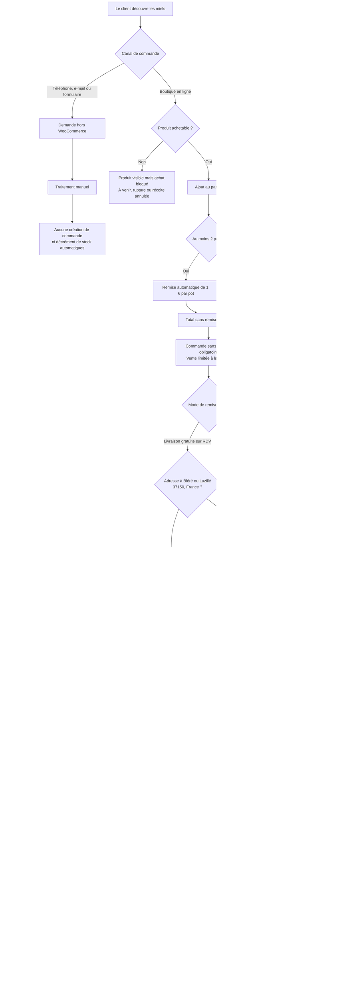
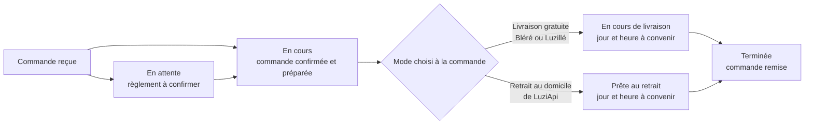

# Processus métier — vente et traitement des commandes de miel

> **État de la production relevé et mis à jour le 6 septembre 2026.** Ce document décrit le
> fonctionnement réellement configuré à cette date. Il distingue les automatismes WooCommerce
> des opérations manuelles et signale les décisions qui restent à prendre.

## 1. Périmètre et socle

Le processus couvre la vente des pots de miel, depuis la prise de commande jusqu'à la clôture,
l'annulation ou le remboursement. Il inclut les commandes passées sur la boutique ainsi que les
demandes reçues directement par téléphone, e-mail ou formulaire de contact.

La production utilise :

- WordPress 7.1 en français, avec le fuseau horaire réglé sur UTC ;
- WooCommerce 10.8.1 avec HPOS activé pour le stockage des commandes ;
- le thème LuziApi 1.0.0 ;
- des pages Panier et Commander fondées sur les shortcodes WooCommerce classiques ;
- uniquement des paiements hors ligne ;
- les e-mails transactionnels natifs de WordPress/o2switch, pas Brevo.

L'intervention n'a lu aucune commande ni donnée client. Elle a activé et vérifié le processus de
livraison/retrait décrit ci-dessous sans créer de commande et sans envoyer d'e-mail.

## 2. Vue d'ensemble

## 3. Canaux d'entrée

### Boutique en ligne

- Depuis l'accueil, « Voir le miel » ouvre la fiche produit ; l'accueil ne fait pas d'ajout direct.
- Depuis la boutique, l'ajout au panier est réalisé en AJAX, sans changement de page.
- Depuis une fiche produit, l'ajout suit le fonctionnement WooCommerce standard.
- Le mini-panier et son compteur sont rafraîchis en AJAX.
- Le client peut commander sans créer de compte.

### Téléphone, e-mail et formulaire

Le site invite aussi à commander par téléphone, e-mail ou formulaire Contact Form 7. Ces demandes
sont envoyées à la boîte de contact, mais **ne créent pas automatiquement une commande
WooCommerce** et **ne mettent pas le stock à jour**.

Pour conserver une trace homogène, une commande directe doit donc être ressaisie manuellement dans
WooCommerce, ou le stock doit être corrigé séparément.

## 4. Catalogue et disponibilité actuels

Tous les produits sont des pots physiques simples de 1 kg. Le stock est suivi individuellement,
les commandes en souffrance sont interdites et plusieurs pots identiques peuvent être commandés.

| Produit | Prix | État constaté | Achat |
|---|---:|---|---|
| Miel de Printemps | 10 € | En stock | Autorisé |
| Miel d'Acacia | 14 € | En stock | Autorisé |
| Miel de Châtaignier | 12 € | Hors stock et « Récolte annulée » | Bloqué |
| Miel de Tournesol | 11 € | En stock | Autorisé |

Règles d'affichage et de vente :

- « Récolte annulée » force l'impossibilité d'acheter, même si un stock résiduel existe.
- « À venir » peut être activé manuellement ou découler d'un stock nul.
- Un produit hors stock reste visible dans le catalogue ; il n'est pas masqué.
- La quantité exacte disponible est masquée au client.
- Les retours en stock et changements de saison nécessitent une action d'administration.

## 5. Prix, remise, coupons et taxes

- Devise : euro.
- Les taxes sont désactivées ; WooCommerce ne calcule donc ni TVA ni taxe de livraison.
- Une remise LuziApi est appliquée automatiquement dès que le panier contient au moins deux pots :
  **−1 € × nombre total de pots**.
- Exemples : deux pots donnent −2 €, trois pots donnent −3 €.
- Les codes promo sont autorisés dans WooCommerce, mais aucun coupon n'est actuellement publié.
- La remise LuziApi est une ligne de frais négative, pas un coupon. Si un coupon est créé plus tard,
  il pourra se cumuler avec elle sauf règle supplémentaire.

## 6. Tunnel de commande et identité du client

- Les ventes sont limitées au pays France.
- Le paiement invité est autorisé et constitue le parcours normal.
- La connexion n'est pas suggérée pendant la commande.
- La création de compte est désactivée pendant la commande et depuis « Mon compte ».
- Le champ Société est masqué.
- Le complément d'adresse et le téléphone sont facultatifs.
- Les notes de commande utilisent le comportement WooCommerce par défaut, donc elles sont
  disponibles au client.
- Une politique de confidentialité est associée au site.
- **Aucune page de conditions générales de vente n'est associée à WooCommerce** : aucune case
  d'acceptation des CGV n'est donc imposée par le tunnel.

La page « Mon compte » existe, mais elle sert essentiellement aux comptes déjà créés ou créés
manuellement puisque l'inscription publique est coupée.

## 7. Livraison et retrait

La livraison est activée pour les pays où LuziApi vend, actuellement la France. Le checkout
enregistre obligatoirement l'un des deux choix suivants :

Le panier n'affiche pas de calculateur de frais d'expédition : il ne ferait que demander une
adresse alors que le choix réel est déterminé à l'étape de commande selon la commune saisie.

| Choix affiché | Disponibilité | Organisation du rendez-vous |
|---|---|---|
| Retrait à mon domicile à Luzillé sur RDV | Toutes les commandes françaises | Lieu fixe ; LuziApi prend contact uniquement pour convenir du jour et de l'heure |
| Livraison gratuite sur Luzillé ou Bléré sur RDV | Adresse en France, code postal 37150 et ville Bléré ou Luzillé | LuziApi prend contact pour convenir du jour et de l'heure à l'adresse de la commande |

Le code postal 37150 étant partagé par plusieurs communes, la zone WooCommerce ne suffit pas à
elle seule. Le thème vérifie simultanément le pays, le code postal et la ville. La comparaison de
la ville ignore la casse, les accents et les espaces : `Bléré`, `BLERE`, `Luzillé` et `luzille`
sont donc reconnus. Une autre commune du 37150 ne voit que le retrait.

Un contrôle serveur bloque également une ancienne sélection de livraison devenue invalide après
la modification de l'adresse. L'adresse précise du domicile est centralisée dans les réglages
WooCommerce et injectée dans l'e-mail « Prête au retrait » sans être dupliquée dans le workflow.

Le paiement à la remise n'est actuellement restreint à aucun mode de remise et peut donc être
choisi pour une livraison comme pour un retrait.

## 8. Moyens de paiement et statut initial

| Moyen affiché au client | Statut initial normal | Effet métier |
|---|---|---|
| Virement bancaire / WERO | En attente | Attendre et vérifier le règlement manuellement |
| Paiements par chèque | En attente | Attendre et vérifier le chèque manuellement |
| Espèces ou chèque à la remise | En cours | Préparer la commande ; le statut ne signifie pas que l'argent a déjà été encaissé |

Un compte bancaire BACS est configuré, sans que ses coordonnées soient reproduites dans ce dépôt.
Aucune passerelle ne prend un paiement en ligne et aucune ne sait exécuter un remboursement par API.

Le chèque est proposé deux fois sous des logiques différentes :

- « Paiements par chèque » place la commande en attente du règlement ;
- « Espèces ou chèque à la remise » place immédiatement la commande en cours.

Ce doublon est fonctionnel mais peut être ambigu pour le client. Il ne faut pas retirer l'une des
options sans décision explicite.

## 9. Cycle de vie des commandes

| Statut | Signification opérationnelle | Stock | Action attendue |
|---|---|---|---|
| Brouillon | Statut enregistré par WooCommerce pour certains tunnels en blocs | Réservation possible | Normalement inutilisé ici, car le checkout est en shortcode classique |
| Attente paiement | Commande créée mais paiement non traité | Réservé au maximum 60 min | Attendre le passage de la passerelle ou annuler |
| En attente | Paiement hors ligne à vérifier | Décrémenté | Vérifier le virement/WERO ou le chèque, puis passer en cours |
| En cours | Commande confirmée et à préparer | Décrémenté | Préparer les pots ; aucun rendez-vous n'est encore annoncé par cet e-mail |
| En cours de livraison | Commande prête, livraison locale à organiser | Déjà décrémenté | Prendre contact pour fixer le jour et l'heure, puis livrer |
| Prête au retrait | Commande prête au domicile de LuziApi | Déjà décrémenté | Prendre contact pour fixer uniquement le jour et l'heure du retrait |
| Terminée | Commande effectivement livrée ou retirée | Déjà décrémenté | Plus d'action normale |
| Échouée | Paiement déclaré en échec | Voir avertissement ci-dessous | Examiner puis annuler si la commande ne sera pas reprise |
| Annulée | Commande abandonnée | Restauré si le stock avait été décrémenté | Informer le client si nécessaire, puis archiver |
| Remboursée | Remboursement total saisi | Selon l'option choisie lors du remboursement | Vérifier que l'argent a réellement été rendu |

### Points de vigilance sur le stock

- Le stock est décrémenté au passage en **En attente**, **En cours**, **En cours de livraison**,
  **Prête au retrait** ou **Terminée**, une seule fois. Les appels supplémentaires sont
  idempotents : ils ne redécrémentent pas un stock déjà traité.
- Une commande restée en **Attente paiement** est annulée après 60 minutes et sa réservation est
  libérée. Ce délai ne concerne pas les commandes **En attente** issues du virement ou du chèque.
- Dans WooCommerce 10.8.1, le passage à **Échouée** ne restaure pas automatiquement un stock déjà
  décrémenté. Passer ensuite la commande à **Annulée** restaure le stock.
- Passer manuellement le statut à **Remboursée** ne rend pas l'argent. Pour un remboursement hors
  ligne, utiliser l'écran de remboursement, effectuer le paiement retour séparément et cocher la
  remise en stock si les pots reviennent réellement dans l'inventaire.
- Avant de mettre une commande à la corbeille, l'annuler si son stock doit être restauré.

## 10. Liste exacte des e-mails WooCommerce

Cette section repose sur une lecture des objets d'e-mail et de leurs options en production le
6 septembre 2026, complétée après le déploiement du nouveau workflow. Les messages **En attente**,
**En cours** et **Terminée** de WooCommerce sont remplacés par les formulations LuziApi ; deux
messages accompagnent les nouveaux statuts **En cours de livraison** et **Prête au retrait**.

Dans les objets :

- `{site_title}` est remplacé par `LuziApi` ;
- `{order_number}` est remplacé par le numéro réel de la commande ;
- le contenu du message ajoute les coordonnées utiles, les produits, quantités, prix, total et,
  selon le modèle, les instructions de paiement ou la note adressée au client.

### E-mails automatiques envoyés à LuziApi

Ces trois notifications de commande sont activées et destinées à
`luziapi37150@gmail.com`.

| Nom WooCommerce | Déclencheur exact | Objet exact avant remplacement des variables |
|---|---|---|
| Nouvelle commande | **Attente paiement**, **Échouée** ou **Annulée** → **En attente**, **En cours** ou **Terminée** | `[{site_title}] : Vous avez une nouvelle commande n°{order_number}` |
| Commande annulée | **En attente** ou **En cours** → **Annulée** | `[{site_title}] : La commande n°{order_number} a été annulée` |
| Commande échouée | **Attente paiement** ou **En attente** → **Échouée** | `[{site_title}] : La commande n°{order_number} a échoué` |

L'e-mail « Nouvelle commande » est normalement envoyé une seule fois par commande. WooCommerce
enregistre le fait qu'il a déjà été envoyé et interdit sa répétition, sauf extension qui modifierait
explicitement ce comportement.

### E-mails automatiques envoyés au client

| Nom WooCommerce | Déclencheur exact | Objet exact avant remplacement des variables | État |
|---|---|---|---|
| Commande en attente | **Attente paiement**, **Échouée** ou **Annulée** → **En attente** | `Commande LuziApi n°{order_number} reçue — règlement en attente` | Activé — modèle LuziApi |
| Commande confirmée | **Attente paiement**, **Échouée**, **En attente** ou **Annulée** → **En cours** | `Votre commande LuziApi n°{order_number} est confirmée` | Activé — modèle LuziApi |
| En cours de livraison | Toute entrée dans **En cours de livraison** | `Organisons la livraison de votre commande LuziApi n°{order_number}` | Activé — modèle LuziApi |
| Prête au retrait | Toute entrée dans **Prête au retrait** | `Votre commande LuziApi n°{order_number} est prête au retrait` | Activé — modèle LuziApi |
| Commande terminée | Toute entrée dans le statut **Terminée** | `Votre commande LuziApi n°{order_number} a bien été remise` | Activé — modèle LuziApi |
| Commande échouée | Toute entrée dans le statut **Échouée** | `Votre commande {site_title} n’a pas abouti` | Activé |
| Commande remboursée — total | Remboursement total réellement saisi dans WooCommerce | `Votre commande n°{order_number} sur {site_title} a été remboursée` | Activé |
| Commande remboursée — partiel | Remboursement partiel réellement saisi dans WooCommerce | `Votre commande n°{order_number} sur {site_title} a été partiellement remboursée` | Activé |
| Note client | Ajout d'une note avec l'option **Note au client** | `Une note a été ajoutée à votre commande depuis {site_title}` | Activé |
| Commande annulée | **En attente** ou **En cours** → **Annulée** | `[{site_title}] : Votre commande nº {order_number} a été annulée.` | **Désactivé** |

Une note privée n'envoie pas l'e-mail « Note client ». Seule une note explicitement marquée
**Note au client** le déclenche.

### E-mail de commande envoyé uniquement à la demande

L'action d'administration « Envoyer les détails de la commande / demander le paiement » adresse
manuellement au client l'e-mail suivant :

| Nom WooCommerce | Déclencheur | Objet exact |
|---|---|---|
| Détails de la commande | Action manuelle depuis la commande ; jamais sur un simple changement de statut | `Détails pour la commande #{order_number} sur {site_title}` |

Ce modèle est signalé `manual` par WooCommerce. Son indicateur technique `enabled` vaut donc
`false`, mais cela ne le rend pas indisponible : il est précisément prévu pour être lancé depuis
une action manuelle. Pour une commande non payée, son contenu peut inclure le lien permettant de
finaliser le paiement.

### Nombre d'e-mails par scénario courant

| Scénario | E-mails effectivement déclenchés |
|---|---|
| Nouvelle commande par **virement / WERO** ou **chèque** | 2 : « Nouvelle commande » à LuziApi + « Commande en attente » au client |
| Nouvelle commande avec **espèces ou chèque à la remise** | 2 : « Nouvelle commande » à LuziApi + « Commande en cours » au client |
| Paiement vérifié : **En attente → En cours** | 1 : confirmation et mise en préparation au client |
| Commande prête pour une livraison : **En cours → En cours de livraison** | 1 : prise de contact pour le jour et l'heure de livraison |
| Commande prête au retrait : **En cours → Prête au retrait** | 1 : adresse fixe de retrait + prise de contact pour le jour et l'heure |
| Commande remise : **En cours de livraison / Prête au retrait → Terminée** | 1 : confirmation de remise et remerciement au client |
| **En attente / En cours → Annulée** | 1 : « Commande annulée » à LuziApi ; **aucun e-mail au client** |
| **Attente paiement / En attente → Échouée** | 2 : « Commande échouée » à LuziApi + « Commande échouée » au client |
| Autre statut → **Échouée** | 1 : « Commande échouée » au client ; pas de notification administrateur prévue par le modèle |
| Remboursement partiel ou total saisi | 1 : e-mail de remboursement correspondant au client |
| Note privée ajoutée | Aucun e-mail |
| Note au client ajoutée | 1 : « Note client » au client |
| Commande mise à la corbeille ou supprimée | Aucun e-mail dédié |
| Statut enregistré sans changement | Aucun e-mail de changement de statut |

Le passage manuel au seul statut **Remboursée** n'est pas équivalent à l'enregistrement d'un
remboursement : c'est l'opération de remboursement WooCommerce, partielle ou totale, qui déclenche
le message correspondant.

### Autres modèles WooCommerce, hors traitement normal d'une commande

| Modèle | Déclencheur / usage | Objet exact | État |
|---|---|---|---|
| Réinitialisation du mot de passe | Demande de réinitialisation d'un compte client | `Réinitialiser votre mot de passe pour {site_title}` | Activé |
| Nouveau compte | Création d'un compte client | `Votre compte sur {site_title} a été créé` | Activé, mais inscription publique actuellement désactivée |
| Passerelle de paiement activée | Activation d'un moyen de paiement dans l'administration | `[{site_title}] Passerelle de paiement « {gateway_title} » activée` | Activé ; notification technique administrateur |
| Commande PDV terminée | Action manuelle liée au module point de vente | `Votre achat en boutique nº {order_number} auprès de LuziApi` | Désactivé |
| Commande PDV remboursée | Action manuelle liée au module point de vente | `Votre commande nº {order_number} auprès de LuziApi a été remboursée` | Désactivé |

Les alertes de stock faible et de rupture sont également activées, mais elles ne sont pas des
e-mails de commande. Elles partent vers une **autre adresse personnelle**, volontairement non
reproduite ici. Seuil de stock faible : 2 ; seuil de rupture : 0.

### Conséquences opérationnelles

- passer en **En cours** confirme la commande et sa préparation sans annoncer de rendez-vous ;
- passer en **En cours de livraison** ou **Prête au retrait** envoie le message de prise de contact
  correspondant ;
- passer en **Terminée** confirme que la commande a bien été remise et ne dit plus qu'elle est en
  chemin ;
- changer une commande en **Annulée** avertit LuziApi uniquement si elle était **En attente** ou
  **En cours**, mais n'avertit jamais automatiquement le client avec le réglage actuel ;
- pour informer le client d'une annulation ou donner une explication libre, ajouter une **Note au
  client** avant de changer le statut ;
- les détails de commande et le lien de paiement peuvent être renvoyés manuellement depuis les
  actions de la commande.

### Transport des e-mails

- Expéditeur technique : `LuziApi <no-reply@luziapi.fr>`.
- Adresse de réponse visible : boîte de contact LuziApi.
- Transport : fonction native `mail()` de l'hébergement o2switch, avec signature DKIM.
- Brevo ne transporte pas les e-mails de commande et aucun SMS n'est envoyé lors d'une commande.
- Brevo sert aux inscriptions et campagnes de newsletter ; la publication d'un article est un
  processus séparé qui peut déclencher un e-mail et un SMS à la liste.

## 11. Procédures opérationnelles recommandées avec les réglages actuels

### Virement bancaire / WERO

1. Le client valide la commande ; elle passe en **En attente**.
2. WooCommerce décrémente le stock.
3. LuziApi reçoit « Nouvelle commande » et le client reçoit « Commande en attente ».
4. Vérifier le compte bancaire ou WERO.
5. Quand le paiement est confirmé, passer la commande en **En cours** ; le client reçoit la
   confirmation de mise en préparation.
6. Préparer les pots, puis suivre le mode enregistré dans la commande :

   - livraison : passer en **En cours de livraison**, puis prendre contact pour convenir du jour
     et de l'heure ;
   - retrait : passer en **Prête au retrait**, puis prendre contact pour convenir uniquement du
     jour et de l'heure au domicile indiqué dans l'e-mail.

7. Après livraison ou retrait effectif, passer en **Terminée** ; le client reçoit la confirmation
   de remise et le remerciement.
8. Si le règlement n'arrive pas, informer le client si nécessaire puis passer en **Annulée** pour
   restaurer le stock. Le délai de 60 minutes ne s'applique pas au statut En attente.

### Chèque envoyé ou reçu avant remise

Le flux est identique au virement : **En attente → En cours → En cours de livraison / Prête au
retrait → Terminée** après vérification du chèque.

### Espèces ou chèque à la remise

1. La commande passe directement en **En cours** et le stock est décrémenté.
2. LuziApi et le client reçoivent leurs e-mails respectifs.
3. Préparer la commande, puis passer en **En cours de livraison** ou **Prête au retrait** selon le
   choix enregistré au checkout.
4. Prendre contact pour fixer le jour et l'heure, remettre les pots et encaisser.
5. Passer en **Terminée** uniquement après la remise et l'encaissement.

### Annulation

1. Si une explication doit être envoyée, ajouter d'abord une note au client.
2. Passer en **Annulée** afin de restaurer le stock.
3. Vérifier la note système de restauration du stock.
4. Mettre à la corbeille seulement si la conservation de la commande n'est pas nécessaire.

### Remboursement

1. Effectuer le remboursement réel hors du site, car les passerelles activées ne le font pas.
2. Utiliser l'action de remboursement WooCommerce pour tracer le montant.
3. Choisir explicitement si les articles doivent être remis en stock.
4. Vérifier l'e-mail de remboursement et la note système correspondante.

## 12. Traçabilité

- Les commandes sont conservées dans les tables HPOS de WooCommerce.
- Chaque changement de statut ajoute une note système à la commande.
- Une note privée documente une action interne sans prévenir le client.
- Une note au client est historisée et déclenche un e-mail.
- Les statuts métier **En cours de livraison** et **Prête au retrait** sont conservés dans
  l'historique HPOS et déclenchent chacun un e-mail au client.
- Il n'existe pas d'automatisation de créneau, de suivi de colis ou d'encaissement : la prise de
  contact et la saisie des statuts restent manuelles.
- Les commandes directes hors boutique ne sont pas tracées automatiquement.

## 13. Écarts et décisions à prendre

Ces points restent ouverts après la mise en place du workflow de remise.

| Priorité | Constat | Risque / conséquence | Décision possible |
|---|---|---|---|
| Haute | Aucune page CGV associée | Pas d'acceptation explicite des CGV au checkout | Créer/valider les CGV puis les associer |
| Moyenne | Annulation client désactivée | Le client n'est pas prévenu automatiquement | Activer l'e-mail ou formaliser l'usage d'une note client |
| Moyenne | Choix du statut de remise manuel | Risque de sélectionner « livraison » pour un retrait, ou inversement | Toujours vérifier la méthode enregistrée dans la commande |
| Moyenne | Alertes de stock envoyées ailleurs | Risque de surveillance fragmentée | Confirmer ou aligner le destinataire |
| Moyenne | Fuseau WordPress UTC et formats de date anglo-saxons | Horaires d'administration décalés ou ambigus | Régler Europe/Paris et des formats français |
| Moyenne | Deux choix de paiement par chèque | Différence « avant remise » / « à la remise » peu évidente | Clarifier les libellés sans retirer une option sans accord |
| Faible | Coupons autorisés mais inutilisés | Champ promo visible sans campagne | Conserver en prévision ou désactiver après décision |
| Faible | Page Mon compte sans inscription publique | Utilité limitée pour les nouveaux clients | Assumer le parcours invité ou revoir la politique de compte |

## 14. Mise en production et contrôles du workflow

Le workflow est actif en production depuis le 6 septembre 2026. Les deux choix présentés au client
sont :

- **Retrait à mon domicile à Luzillé sur RDV** : disponible pour toutes les commandes ; le lieu
  est fixe et seuls le jour et l'heure sont convenus avec le client ;
- **Livraison gratuite sur Luzillé ou Bléré sur RDV** : disponible uniquement pour une adresse en
  France dont le code postal est 37150 et dont la ville, comparée sans tenir compte de la casse ou
  des accents, est Bléré ou Luzillé.

L'e-mail de retrait lit l'adresse centralisée dans les réglages de la boutique WooCommerce.

### E-mails actifs pour ce nouveau cycle

| Statut | Objet | Information principale |
|---|---|---|
| En attente | `Commande LuziApi n°{order_number} reçue — règlement en attente` | Commande reçue ; préparation après confirmation du paiement |
| En cours | `Votre commande LuziApi n°{order_number} est confirmée` | Commande confirmée et mise en préparation, sans prise de rendez-vous à ce stade |
| En cours de livraison | `Organisons la livraison de votre commande LuziApi n°{order_number}` | Prise de contact pour convenir du jour et de l'heure à l'adresse de livraison |
| Prête au retrait | `Votre commande LuziApi n°{order_number} est prête au retrait` | Retrait au domicile de LuziApi ; prise de contact uniquement pour le jour et l'heure |
| Terminée | `Votre commande LuziApi n°{order_number} a bien été remise` | Confirmation que la commande a été livrée ou retirée |

Contrôles réalisés lors de la mise en service, sans créer de commande ni envoyer d'e-mail :

- livraison active et limitée à la France ;
- adresse privée de retrait présente et correctement injectée par le modèle ;
- Bléré et Luzillé : livraison gratuite + retrait ;
- autre commune du 37150 et adresse hors secteur : retrait uniquement ;
- deux nouveaux statuts enregistrés dans WooCommerce avec HPOS ;
- cinq modèles LuziApi actifs et anciens modèles remplacés sans doublon ;
- empreintes SHA-256 locales et serveur identiques ;
- OPcache vidé ; accueil et boutique servis en HTTP 200.

Une commande de bout en bout et la réception réelle des cinq e-mails devront encore être vérifiées
avec une commande de test dédiée si l'on veut valider la chaîne de délivrabilité complète.

## 15. Références et maintien de la documentation

Sources utilisées :

- audit puis contrôle de mise en production des options WooCommerce du 6 septembre 2026 ;
- code du thème : `inc/shop.php`, `inc/woocommerce.php`, `inc/order-workflow.php` et
  `inc/class-luziapi-order-status-email.php` ;
- code WooCommerce 10.8.1 installé localement, notamment les passerelles, e-mails et hooks de stock ;
- [statuts de commande WooCommerce](https://woocommerce.com/document/managing-orders/order-statuses/) ;
- [réglages des e-mails WooCommerce](https://woocommerce.com/document/configuring-woocommerce-settings/emails/) ;
- [réglages d'inventaire WooCommerce](https://woocommerce.com/document/configuring-woocommerce-settings/products/).

Ce document doit être revu après toute modification des produits, paiements, zones de livraison,
e-mails, comptes clients, taxes, stocks ou statuts. Les réglages étant stockés en base, un changement
dans l'administration ne produit pas automatiquement de modification Git.
